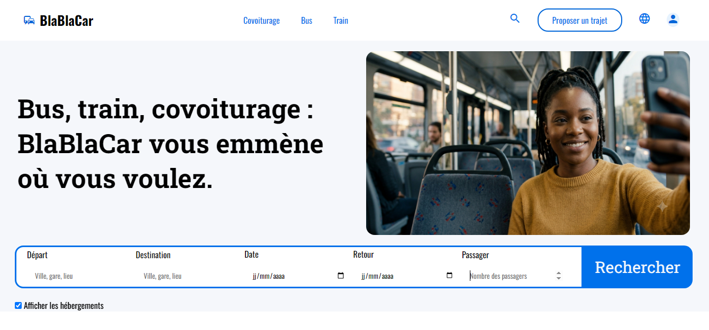
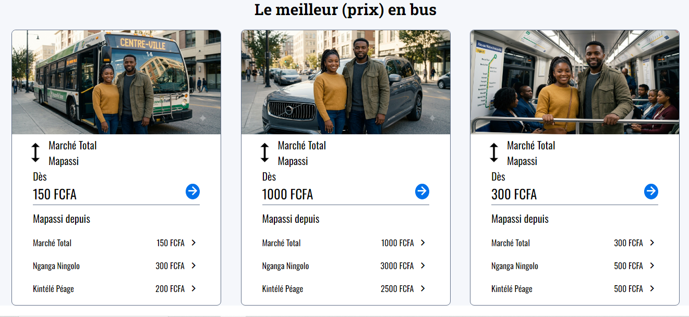

# 🚌 BlaBlaCar — Clone Section Hero & Card Produit

> Reproduction fidèle de la page d'accueil BlaBlaCar · Projet réalisé dans le cadre de la **Cohort 2 — Akieni Academy** (juin 2026)  
> Auteur : **Précieux MAVOUNGOU BAYONNE** · Brazzaville, République du Congo 🇨🇬

---

## 📸 Aperçu

| Section Hero | Cards Tarifaires |
|---|---|
|  |  |

---

## 📋 Description

Clone de la page d'accueil de [BlaBlaCar](https://www.blablacar.fr), reproduisant :

- La **barre de navigation** avec logo, menus de transport et actions utilisateur
- La **section héro** avec titre accrocheur et image principale
- Le **formulaire de recherche** de trajet (départ, destination, date, retour, passagers)
- Les **cartes tarifaires** pour les trois modes de transport disponibles à Brazzaville (Bus, Covoiturage, Train)

---

## 🗂️ Structure du projet

```
blablacar-clone/
├── index.html          # Structure HTML5 sémantique de la page
├── style.css           # Feuille de styles (variables CSS, mise en page flex)
├── main.png            # Image héro (femme dans un bus)
├── bus.png             # Image carte Bus
├── covoiturage.png     # Image carte Covoiturage
├── train.png           # Image carte Train
└── README.md           # Ce fichier
```

---

## 🛠️ Technologies utilisées

| Technologie | Usage |
|---|---|
| `HTML5` | Structure sémantique (header, nav, main, section, article, form, fieldset) |
| `CSS3` | Mise en page Flexbox, variables custom, effets hover |
| Google Fonts | Oswald (navigation) + Roboto Slab (titres) |
| Material Icons | Icônes de navigation et d'interface (Google) |

---

## ✨ Fonctionnalités reproduites

- ✅ Header fixe avec deux barres de navigation (transport + actions)
- ✅ Logo avec icône Material Icons et style BlaBlaCar
- ✅ Bouton "Proposer un trajet" avec bordure arrondie et effet hover
- ✅ Bouton profil circulaire
- ✅ Section héro : titre + image côte à côte (Flexbox)
- ✅ Formulaire de recherche : fieldset horizontal + bouton "Rechercher" accolé
- ✅ Option "Afficher les hébergements" (checkbox)
- ✅ 3 cartes tarifaires (Bus, Covoiturage, Train) avec :
  - Image en en-tête
  - Itinéraire avec icône de rotation
  - Prix minimum + bouton flèche
  - Liste des arrêts cliquables avec tarifs

---

## 🎨 Palette de couleurs

| Variable | Valeur | Rôle |
|---|---|---|
| `--bouton_nav` | `#0066d9` | Bleu principal (boutons, nav) |
| `--couleur_recherche` | `#0071eb` | Bleu vif (formulaire, fieldset) |
| `--bg_color` | `#f5f7fb` | Fond gris clair des sections |
| `--bg_color2` | `#ffffff` | Fond blanc (header, cartes) |
| `--couleur_input` | `#616f88` | Gris des bordures et inputs |

---

## 🗺️ Trajets illustrés (Brazzaville)

Les cartes tarifaires présentent des trajets locaux réels :

| Arrêt | Bus | Covoiturage | Train |
|---|---|---|---|
| Marché Total | 150 FCFA | 1 000 FCFA | 300 FCFA |
| Nganga Ningolo | 300 FCFA | 3 000 FCFA | 500 FCFA |
| Kintélé Péage | 200 FCFA | 2 500 FCFA | 500 FCFA |

---

## 📦 Installation & utilisation

1. Cloner le dépôt :
   ```bash
   git clone https://github.com/votre-username/blablacar-clone.git
   ```
2. Ajouter les images (`main.png`, `bus.png`, `covoiturage.png`, `train.png`) dans le dossier.
3. Ouvrir `index.html` dans un navigateur — aucune dépendance requise.

---

## 📚 Contexte pédagogique

Ce projet fait partie du cursus **Akieni Academy Cohort 2** — module Frontend Web Development.  
Objectifs travaillés :

- Sémantique HTML5 (`header`, `nav`, `main`, `section`, `article`, `form`, `fieldset`)
- Mise en page avec **CSS Flexbox**
- Utilisation des **variables CSS custom** (`--var`)
- Intégration de **Google Fonts** et **Material Icons**
- Reproduction fidèle d'une interface existante

---

## 📬 Contact

- 📧 **Email :** bayonnepre@gmail.com
- 🎓 **Formation :** Akieni Academy — Cohort 2 Fullstack Developer
- 📍 **Localisation :** Brazzaville, République du Congo

---

## 📄 Licence

© 2026 Précieux MAVOUNGOU BAYONNE. Projet éducatif — reproduction à des fins d'apprentissage.
